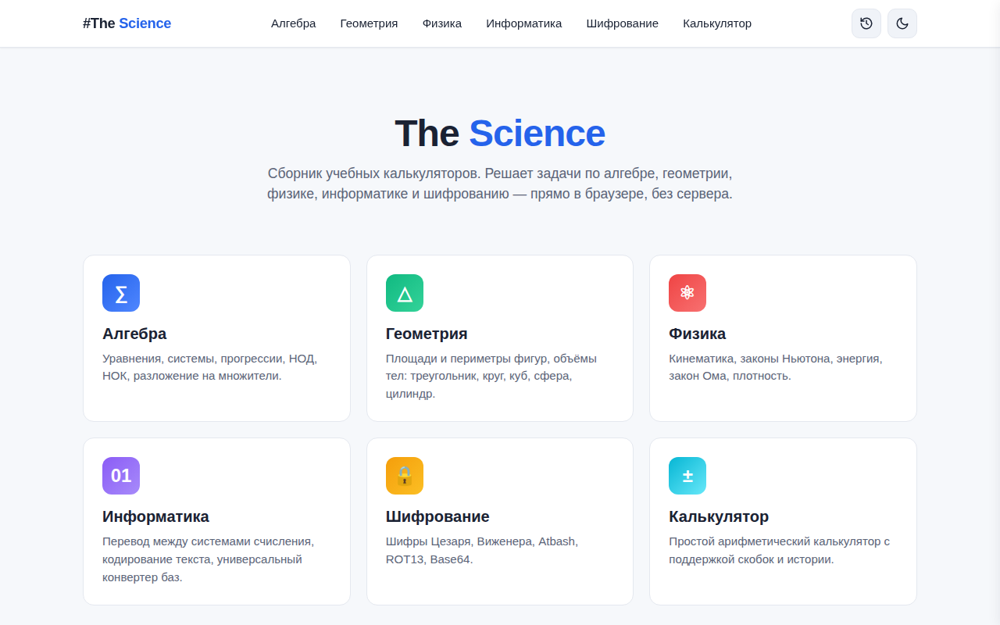

# The Science

**[Открыть сайт →](https://reix88.github.io/science/)**

Сборник интерактивных учебных калькуляторов. Работает **без сервера** — просто открой `index.html` в браузере или разверни на GitHub Pages.



## Разделы

| Раздел | Что умеет |
|---|---|
| **Алгебра** | Линейные и квадратные уравнения, системы 2×2 и 3×3 (правило Крамера), арифметическая и геометрическая прогрессии (n-й член, сумма, произведение), НОД, НОК, разложение трёхчлена на множители |
| **Геометрия** | Прямоугольник, треугольник (формула Герона), круг, трапеция, параллелограмм; куб, параллелепипед, сфера, цилиндр, конус — площади и объёмы |
| **Физика** | Равномерное и равноускоренное движение, свободное падение, второй закон Ньютона, кинетическая и потенциальная энергия, закон Ома, плотность вещества |
| **Информатика** | DEC ↔ BIN ↔ HEX, текст ↔ двоичный код, универсальный конвертер систем счисления (основания 2–36) |
| **Шифрование** | Шифр Цезаря (рус/англ), шифр Виженера, Atbash, ROT13, Base64 |
| **Калькулятор** | Арифметика со скобками, клавиатурный ввод, история последних 10 вычислений |

## Возможности

- **Пошаговое решение** — каждый калькулятор показывает промежуточные вычисления
- **История** — сохраняется в `localStorage`, открывается кнопкой в шапке
- **Тёмная тема** — переключается кнопкой, запоминается между сессиями
- **Офлайн** — никаких запросов к серверу, весь код работает в браузере
- **Мобильная адаптация** — корректно отображается на экранах от 360 px

## Быстрый старт

```bash
# Склонируй репозиторий
git clone https://github.com/reix88/science.git
cd science

# Открой в браузере
open index.html          # macOS
xdg-open index.html      # Linux
start index.html         # Windows
```

Или разверни бесплатно через **GitHub Pages**: `Settings → Pages → Branch: main → /(root)`.

## Структура проекта

```
index.html              — главная страница
math/                   — алгебра (13 страниц)
geometry/               — геометрия (11 страниц)
physics/                — физика (9 страниц)
computer_science/       — информатика (7 страниц)
encryption/             — шифрование (6 страниц)
calculator/             — калькулятор
assets/
  css/main.css          — дизайн-система (светлая/тёмная тема, адаптив)
  js/core.js            — ядро: тема, история, навигация, утилиты
  js/solvers-math.js    — математические решатели
  js/solvers-geometry.js
  js/solvers-physics.js
  js/solvers-cs.js      — конвертеры систем счисления
  js/solvers-encryption.js
img/                    — скриншоты
```

## Лицензия

[MIT](LICENSE)
